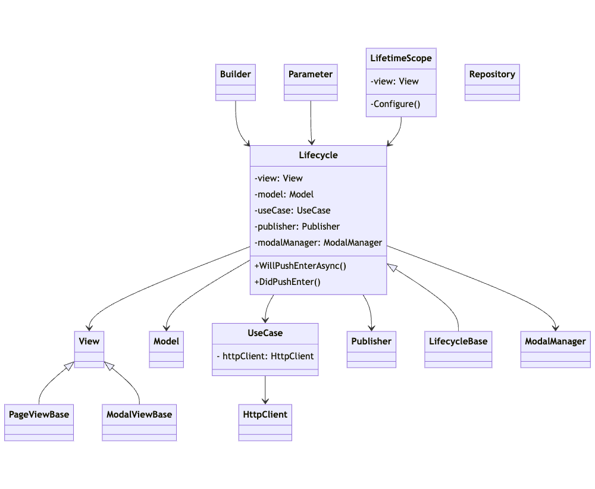

# Design the class

* Based on MVP, common or bloat-prone processing such as communication, screen transitions, etc. are handled by other classes at the right time &#x20;
* The lifetime of a Model only lasts within its screen, and persistent data is kept in the Repository.
* There is one Presenter for each screen.
* As the number of elements in a screen grows, so does the Presenter, which tends to get bloated; we break out large processing into separate classes to reduce the processing that the Presenter does directly.
* Model and View are also one on the default 1 screen, but split them if the screen becomes bloated or if the on-screen elements are independent.

<figure><figcaption>
ScreenSystem Architecture
</figcaption></figure>

* Names like UseCase and Repository adopt terms used in other architectures, such as Clean Architecture, but are not consistent with Clean Architecture usage.
* While referencing clean architecture and other architectures, it is designed with the goal of ease of use and reduced complexity.
