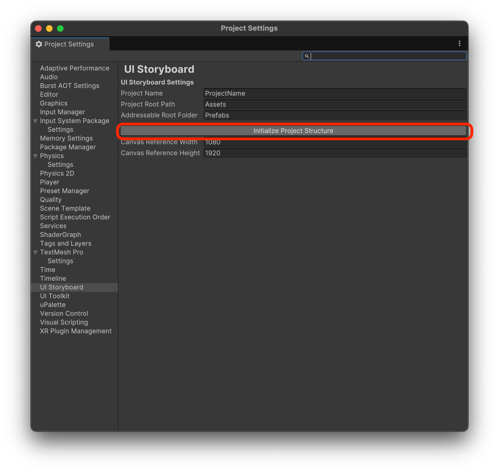
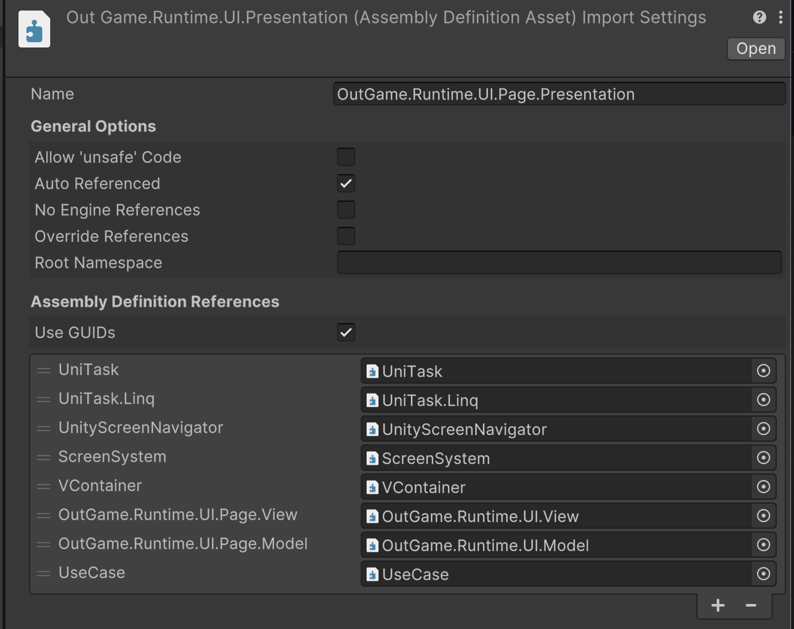

# Use auto-initialization


Be sure to do this in a new project. If you want to apply it to an existing project, manually clean up your asmdefs, folder structure, etc.


## 1. Automatic initialization

### How to use auto-initialization

1. Click `Edit` -> `Project Settings...`

<figure><figcaption>
Project Settings
</figcaption></figure>

2. select the UI Storyboard tab (you may see a Create Setup Variable button on first entry, if so, click it)
3. Enter a project name in the `Project Name` field
4. click the `Initialize Project Structure` button

<figure><figcaption>
UI Storyboard Settings
</figcaption></figure>

## 2. What does auto-initialization do?

### It creates a folder structure.

<figure><figcaption>
Directories
</figcaption></figure>

### Create the Assembly Definitions.

* Proper use of `asmdef` prevents you from writing code that deviates from the promised structure, and makes your project compile faster.
* Auto-initialization.
  * Generates the required asmdefs that are needed at the most basic level.
  * Automatic generation of the most basic required references.

<figure><figcaption>
Assembly Definition
</figcaption></figure>

