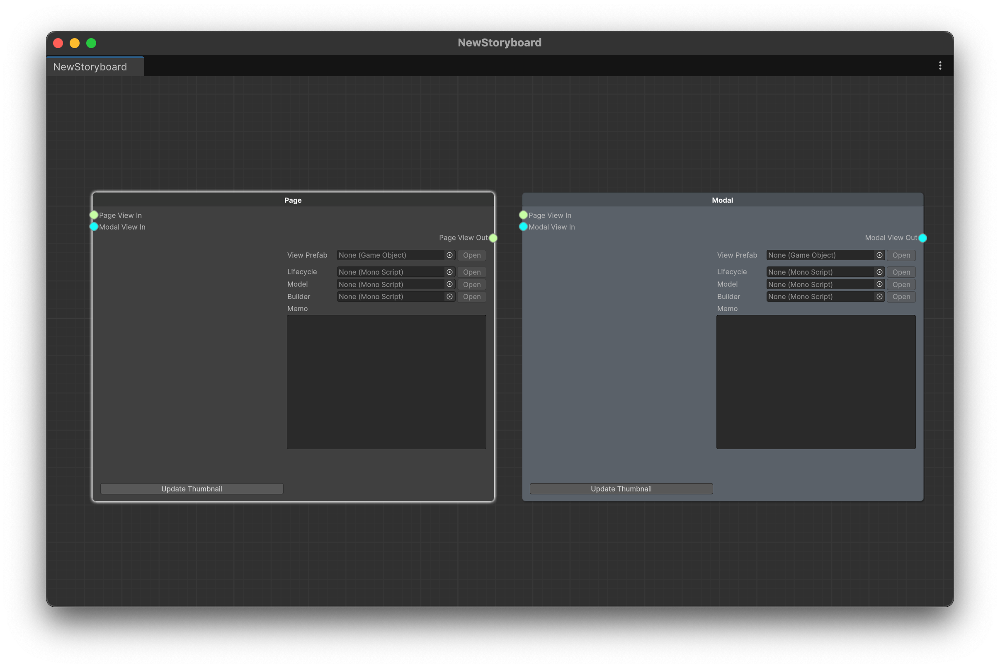

# Add a Page node and a Modal node

## Creating a Page node

1. In a blank space on your storyboard, create a `우클릭` ->> `Create` ->to a blank space on the storyboard. `PageNode`

<figure><figcaption>
Creating PageNode
</figcaption></figure>

<figure><figcaption>
Empty PageNode
</figcaption></figure>

## Create the Modal node

Modal nodes can be created in the same way.

<figure><figcaption>
Page and Modal Node
</figcaption></figure>

