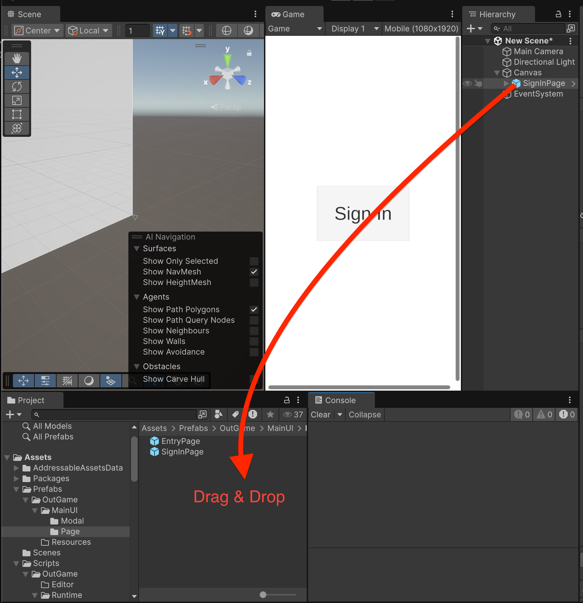
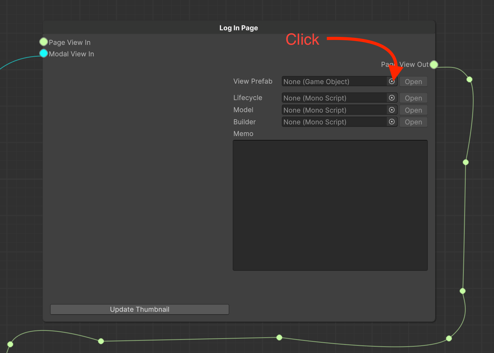

# Adding a mockup UI to a storyboard

## Registering a mockup UI as a prep resource

Grab the top-level GameObject of the Mockup UI you created and drag and drop it into the folder where you want to store your prep.

<figure><figcaption></figcaption></figure>

## Importing a Prep from a Storyboard

Let's import this mockup UI from the storyboard we created earlier.

<figure><figcaption></figcaption></figure>

<figure><figcaption></figcaption></figure>

<figure><figcaption></figcaption></figure>

