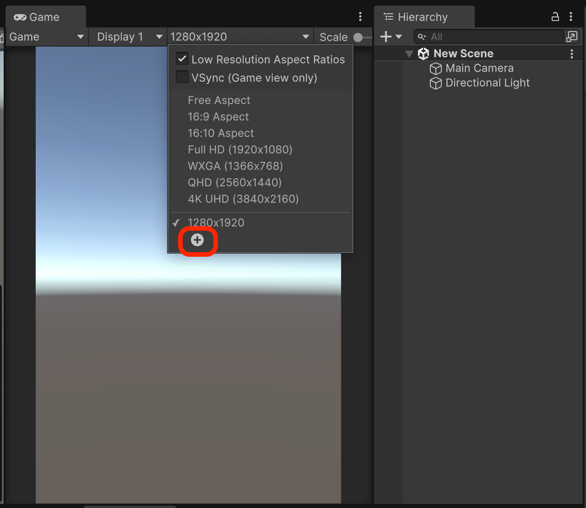

# Configure a simple mockup UI

## Create an empty scene

1. In the Project window, Right-click -> Select `Create` Right-click -> `Scene` Right-click -> -> `Scene`
2. Double-click to open the created scene

## Set to Reference Resolution

### Setting the Player in the Editor to a Reference Resolution

<figure><figcaption></figcaption></figure>

<figure><figcaption></figcaption></figure>

### Setting the canvas resolution to the reference resolution

<figure><figcaption></figcaption></figure>

<figure><figcaption></figcaption></figure>

<figure><figcaption></figcaption></figure>

## Configure the mockup UI

This library was developed with the assumption that the UI will be configured as a UGUI.

- The sample below uses the Image component to create a background and the
- Button TextMeshPro object to represent the login button.

<figure><figcaption></figcaption></figure>

